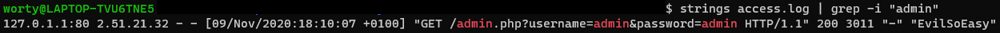

# What the log? 1/3

### Catégorie

Forensics

### Description

J'ai monté un service web sur mon serveur pour une inscription à une raclette. Malheureusement, celui-ci a été piraté et plusieurs fois...
Je vous fourni le fichier de log de apache, si vous pouvez en faire quelque chose.

Trouvé l'adresse IP ainsi que le user-agent utilisé pour se connecter à l'interface administrateur.

PS : Le fichier ne change PAS entre les challenges.

Format: Hero{IP:User-Agent}

### Auteur 

Worty

### Files

Les logs apache "access.log"

### Solution

Quand on télécharge le fichier de log, on voit qu'il y en a beaucoup (+ de 300), il va donc falloir s'attarder sur les requêtes "bizarres". 
On sait que l'on cherche une interface d'administration, on peut donc essayer de grep sur "admin".

### Flag

Hero{2.51.21.32:EvilSoEasy}