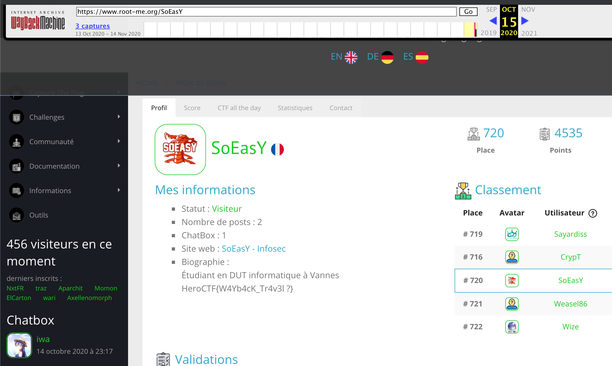

# Racine-moi

### Catégorie
OSINT

### Description
```
[10-11-2020 11:55 xanhacks] Mec tu te rappelles les débuts de Root-Me, on galèrait tellement x)
[10-11-2020 11:57 SoEasY] Ouais de fou mais on a grave avancé maintenant ! Regarde nos alternances !
[10-11-2020 11:59 xanhacks] Ouais c'est sur, jsuis grave content !
[10-11-2020 12:01 SoEasY] Ouais, à l'époque c'était vraiment bien de tout découvrir !
[10-11-2020 12:05 xanhacks] Ouais, sacré époque....
[10-11-2020 12:06 BTTF] Tout ça c'est du passé
```
Format : Hero{flag}

### Auteur
SoEasY

### Solution
Le titre du challenge fait référence à "root-me".
De plus, dans l'énoncé xanhacks et SoEasY parlent du bon vieux temps sur root-me.

On peut alors aller vérifier par exemple le profil de SoEasY [https://www.root-me.org/SoEasY](https://www.root-me.org/SoEasY) et de xanhacks [https://www.root-me.org/xanhacks](https://www.root-me.org/xanhacks) sur root-me.
Et on ne trouve rien...

On peut alors remarquer un petit indice dans l'énoncé qui est `BTTF` (qui veut dire `Back To The Future`) !
On sort alors notre machine à voyager dans le temps : [Internet archive - WayBack Machine](http://web.archive.org/web/).

Si on rentre alors l'adresse du profile root-me de SoEasY on se rend compte que 2 captures ont été effectuées en octobre : le 13 et le 15 octobre.
Rien sur celle de 13, mais quand on regarde la capture du 15 Octobre on remarque un flag dans la biographie !



### Flag
HeroCTF{W4Yb4cK_Tr4v3l ?}
