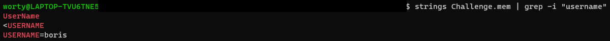

# La quête du COVID 1/4

### Catégorie

Forensics

### Description

Dans cette petite série de challenges, vous serez amener à analyser un dump mémoire.
PS : Le dump NE change PAS entre les challenges.

La semaine dernière, Boris a passé des tests du COVID car il présentait certains symptômes inquiétant. En attendant ces résultats, il a passé son temps sur des forums de Hacking pour se former. Malheureusement, il a commencé à discuter avec quelqu'un et c'est vite pris la tête avec lui....

Pouvez-vous retrouver le nom de l'utilisateur ainsi que le nom du PC ?

Format du flag: Hero{worty:worty-pc} (exemple)
PS2 : Attention, le flag est case sensitive.
PS3 : Le fichier Challenge.zip contient le dump mémoire à analyser. Le fichier Ubuntu_5.4.0-52-generic_profile.zip est le profile à utiliser pour votre analyse.

Le profil : http://challs.heroctf.fr:10000/Ubuntu_5.4.0-52-generic_profile.zip
Le dump : http://challs.heroctf.fr:10000/Challenge.zip

### Auteur 

Worty

### Hint

Ceci pourra vous aider : https://github.com/volatilityfoundation/volatility/wiki/Linux-Command-Reference

### Solution

Après avoir téléchargé l'archive du challenge, le profile correspondant et volatility, il va falloir passer par une étape "0". 
En effet, il va falloir placer le profile donné dans le bon dossier de volatility pour que celui-ci puisse l'utiliser pour l'analyse du dump mémoire. 
Un petit coup de recherche Google, et on voit que le profil doit être placé dans volatilty/plugins/linux/ pour qu'il soit accessible par volatility pour une analyse.

Pour commencer, on va passer par la très célèbre combinaison : "strings grep" pour récupérer les premières informations. 

### Flag

Hero{boris:boris-PC-Security}