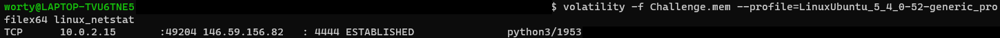
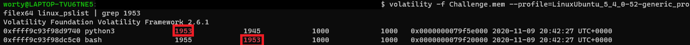

# La quête du COVID 2/4

### Catégorie

Forensics

### Description

Apparemment boris a repéré des activités suspectes sur son ordinateur, comme la création de dossier sans son consentement.. cela paraît trop louche pour être un hasard.

On vous demande de retrouver l'IP qui s'est connecté ainsi que le port. Il faudra aussi récupérer l'heure à laquelle le programme a été lancé.

Rappel : Le dump mémoire à analyser est celui du premier challenge.
Format du flag : Hero{IP:PORT:HH:MM:SS}
Auteur : Worty

### Auteur 

Worty

### Solution

Pour réussir cette étape, je vais passer par plusieurs sous-étape. 
Tout d'abord, il va falloir récupérer le port ainsi que l'IP, pour se faire, je vais utiliser la commande linux_netstat de volatility.

On peut donc en déduire que le programme "python3" a servi pour ouvrir une backdoor sur le PC de boris. 
Je vais donc lister les processus en me concentrant sur celui ayant le PID 1953 pour voir quel programme il a lancé

Ici on voit que le processus python (PID 1953) a lancé le processus bash (PID 1955), c'est donc le programme bash qui est le plus intéressant.

### Flag

Hero{146.59.156.82:4444:20:42:27}