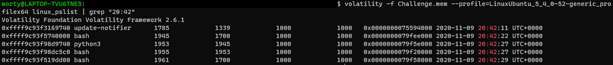
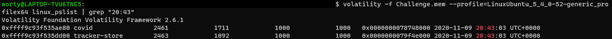
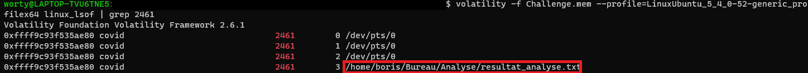

# La quête du COVID 3/4

### Catégorie

Forensics

### Description

Parfait ! Nous avons maintenant identifié l'IP de l'attaquant.
Il semblerait qu'un programme bizarre se soit lancé aussi, Boris ne peut plus ouvrir un de ses fichiers...

Retrouvez le nom du programme, son PID ainsi que le fichier que Boris ne peut plus ouvrir!

Rappel : Le dump mémoire à analyser est celui du premier challenge.
Format du flag : Hero{nom:PID.nomfichier}

### Auteur 

Worty

### Solution

Avec l'épreuve précédente, on sait que le Hacker c'est connecté sur la machine de boris à 20h42 et 27 secondes, on va donc se baser là dessus pour chercher le processus responsable du chiffrement de son fichier d'analayse covid. 
On va donc relister la les processus pour voir ceux qui ont été crées après 20h42. 

Ici, on ne voit aucun processus intéressant, juste le fichier de backdoor et le bash lancé depuis celle-ci, on va donc grep à partir de 20h43.

Un processus retiens mon attention, le processus "covid", qui n'est pas du tout un processus habituel. 
Pour vérifier que c'est bien le bon, on va aller regarder la liste des fichiers ouverts, et grep sur le PID 2461, pour voir si celui-ci à ouvert le fichier des résultats d'analyse de Boris. Pour se faire, je vais utiliser la commande linux_lsof, qui permet de lister les fichiers ouverts au moment de la création du dump mémoire.

Le processus a ouvert le fichier "resultat_analyse.txt" de Boris surement pour le chiffrer, c'est donc notre fichier!
### Flag

Hero{covid:2461:resultat_analyse.txt}
