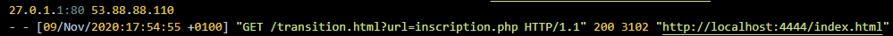
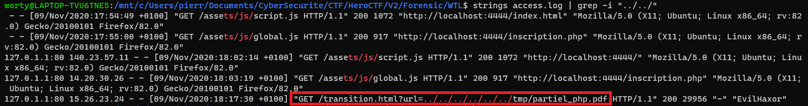

# What the log? 2/3

### Catégorie

Forensics

### Description

Quelque chose de bizarre se passe avec les logs, l'adresse IP que vous avez trouvé n'apparaît qu'une seule fois.., l'attaquant devait surement utiliser un VPN... en plus un de mes fichiers importants a disparu..

Trouvé le fichier qui a été exfiltré !

Format: Hero{nomdufichier}

### Auteur 

Worty

### Solution

D'après la description, on sait qu'on ne peut pas se fier à l'adresse IP trouvée dans la première épreuve. 
Il va donc falloir analyser les logs finement pour trouver le fichier qui a été exfiltré. 
Quand on se concentre sur les logs, on peut voir un fichier qui revient souvent.

On voit que ce fichier charge une page, généralement inscription.php 
Si l'on connait un peu les failles courantes en Web, on sait que ce paramètre "url" dans le fichier "transition.html" peut mener à une Local File Inclusion. 
On peut donc essayer de grep sur "../../" pour voir si l'attaquant est remonté à la racine pour récupérer le fichier.

### Flag

Hero{partiel_php.pdf}