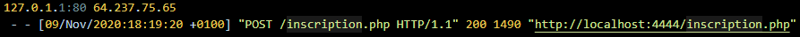
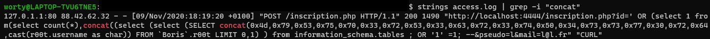
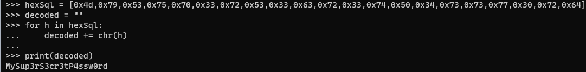

# What the log? 3/3

### Catégorie

Forensics

### Description

Et pour finir, mon mot de passe que j'utilise partout a aussi été exfiltré...

Trouvez le mot de passe exfiltré !

Format: Hero{motdepasse}

### Auteur 

Worty

### Solution

On commence à bien connaître le fichier de log, et on sait qu'un fichier sert à s'inscrire "inscription.php", avec les entrées utilisateurs envoyées en POST. 
On peut donc penser que cette entrée peut aussi être un point d'exfiltration, notamment de la base de données.

Prenant toujours en compte la remarque de l'énoncé de l'épreuve précédente, on va commencer à chercher sur inscription.php et plus particulièrement une injection SQL. 
Pour se faire, on peut notamment grep sur "select" ou sur "concat", qui sont deux instructions SQL.

Ici, on remarque qu'il y a beaucoup de caractères en héxadécimal, on va donc les déchiffrer pour voir ce qu'ils cachent! 

### Flag

Hero{MySup3rS3cr3tP4ssw0rd}