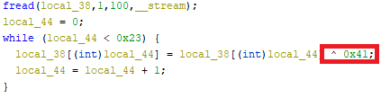
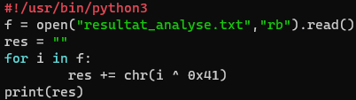
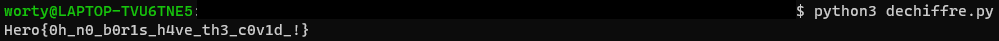

# La quête du COVID 4/4

### Catégorie

Reverse

### Description

Un allié de taille a aussi analysé le dump mémoire et a réussi à extraire deux fichiers, un ELF et un fichier chiffré correspondant aux analyses de Boris.

Déchiffrez le fichier pour connaître le sort de Boris !

Format du flag : Hero{flag}

### Auteur 

Worty

### Fichiers

Un programme compilé "covid". 
Un fichier texte chiffré "resultat_analyse.txt"

### Solution

Pour ce challenge, je vais utiliser Ghidra pour décompiler le programme "covid" et commencer à l'analyser pour savoir ce qu'il fait. 
On remarque tout d'abord que ce programme à été créé spécialement pour chiffré le fichier d'analyse de Boris.

Ensuite, on voit que le fichier ouvre ce dit fichier, et qu'il effectue l'opération xor avec 0x41 (un "A"), et ceci sur l'entièreté du fichier.

Il faut donc tout simplement ouvrir le fichier, et xor avec 0x41 pour retrouver le contenu de base du fichier. Pour cela, je vais utiliser python. 

### Flag

Hero{0h_n0_b0r1s_h4ve_th3_c0v1d_!}